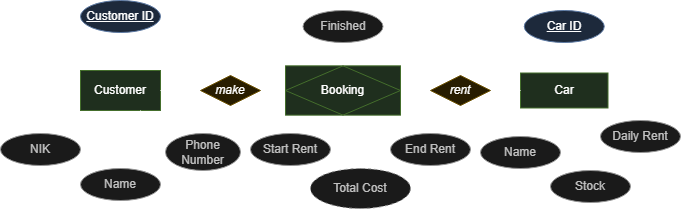
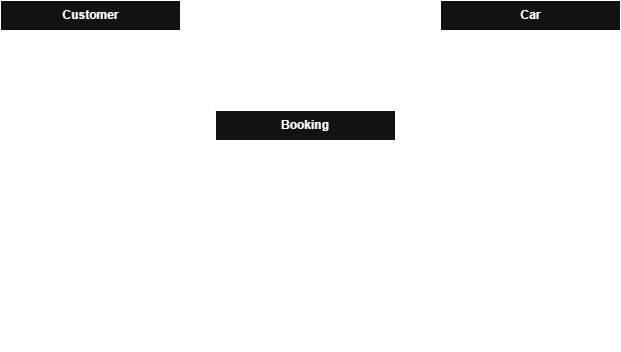

# Car Rental API

A RESTful API for managing a car rental service, built with Golang and PostgreSQL.

## Tech Stack

- **Language:** Go 1.25
- **Framework:** Fiber
- **Database:** PostgreSQL (via pgx/v5)
- **Containerization:** Docker & Docker Compose

## ERD





## Getting Started

### Prerequisites

- Go 1.25+
- Docker & Docker Compose

### Running Locally

1. Copy and configure your environment variables:
   ```bash
   cp .env.example .env
   ```

2. Start the database or you can use your local database (then update the DB information in your .env):
   ```bash
   docker-compose up -d postgres
   ```

3. Run database migrations:
   ```bash
   make migrate-up
   ```

4. Seed initial data:
   ```bash
   go run ./cmd/seed
   ```

5. Start the application:
   ```bash
   go run ./cmd/app
   ```

## API Endpoints
### Cars

- GET /api/cars → list cars
- GET /api/cars/:id → get car by id
- POST /api/cars → add car
- PUT /api/cars/:id → update car
- PATCH /api/cars/:id/stock → change stock
- DELETE /api/cars/:id → delete car

### Customers

- GET /api/customers → list customers
- GET /api/customers/:id → get customer
- POST /api/customers → register customer
- PUT /api/customers/:id → update customer
- DELETE /api/customers/:id → delete customer
- GET /api/customers/:id/bookings → see booking history

### Bookings

- GET /api/bookings → list bookings
- GET /api/bookings/:id → booking detail
- POST /api/bookings → create booking
- PATCH /api/bookings/:id/rent-date → update rent date
- PATCH /api/bookings/:id/finish → mark finished
- DELETE /api/bookings/:id → delete booking
